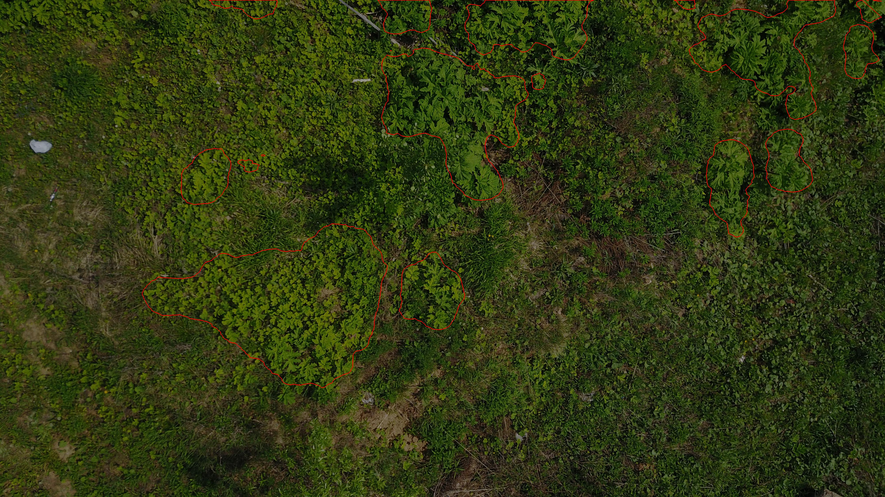
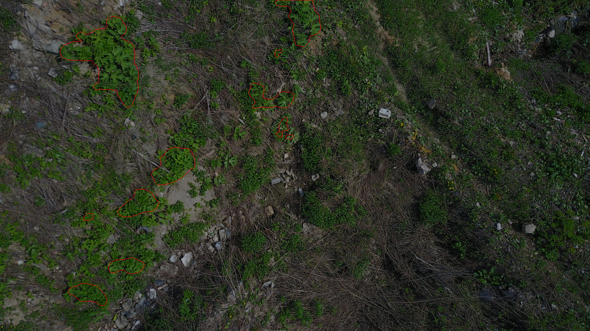
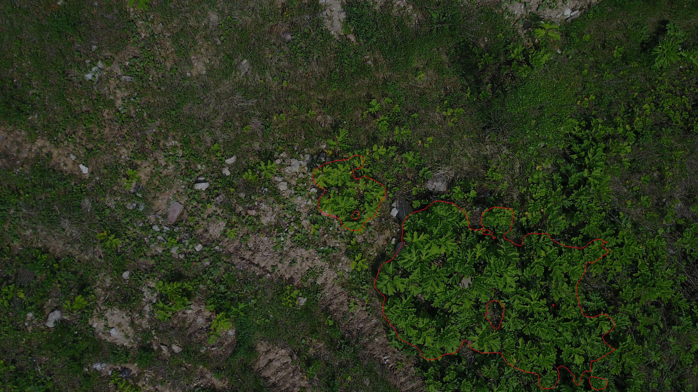
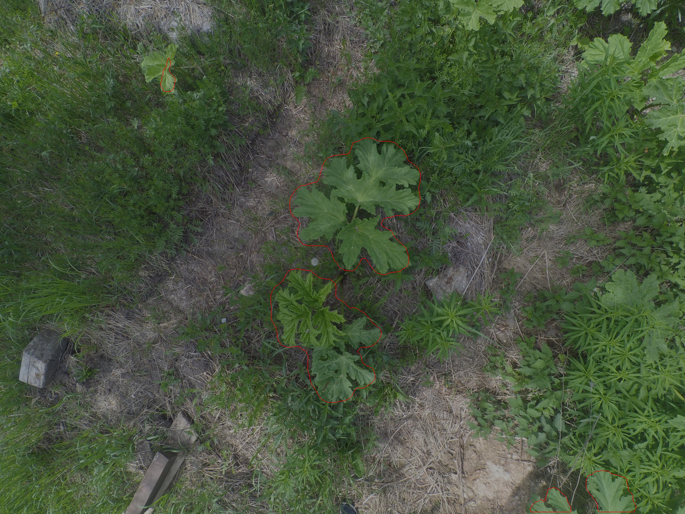
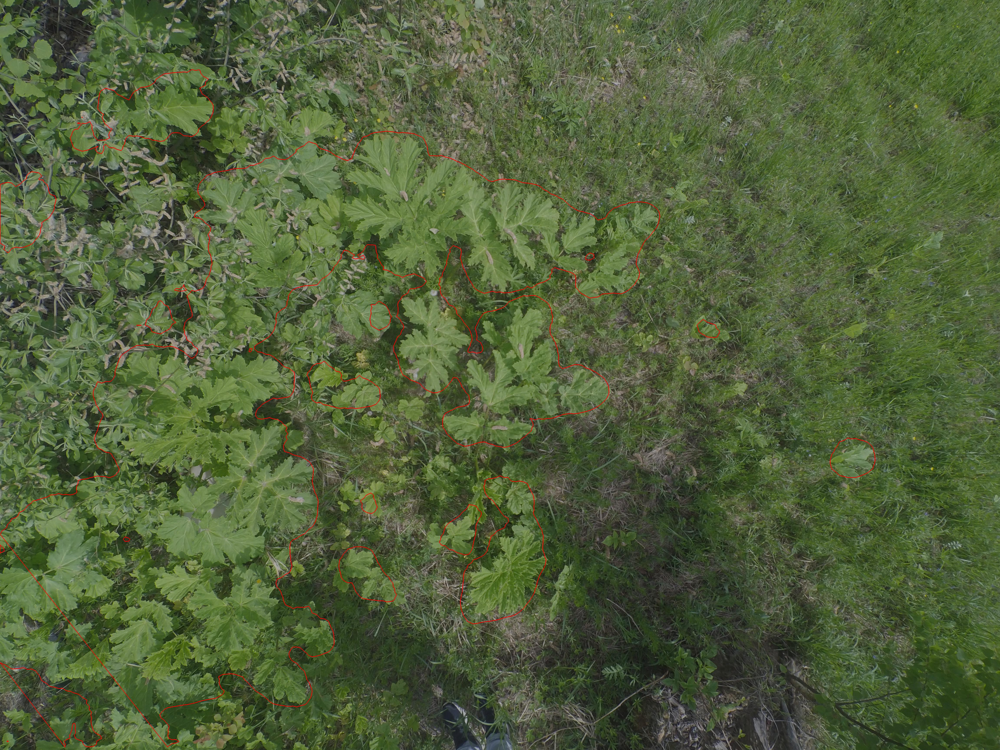

# Neuron for detection Hogweed

This convolutional neural network, trained on 250 frames from a drone, is able to detect the poisonous hogweed plant with great accuracy.

### Examples of images and detection

